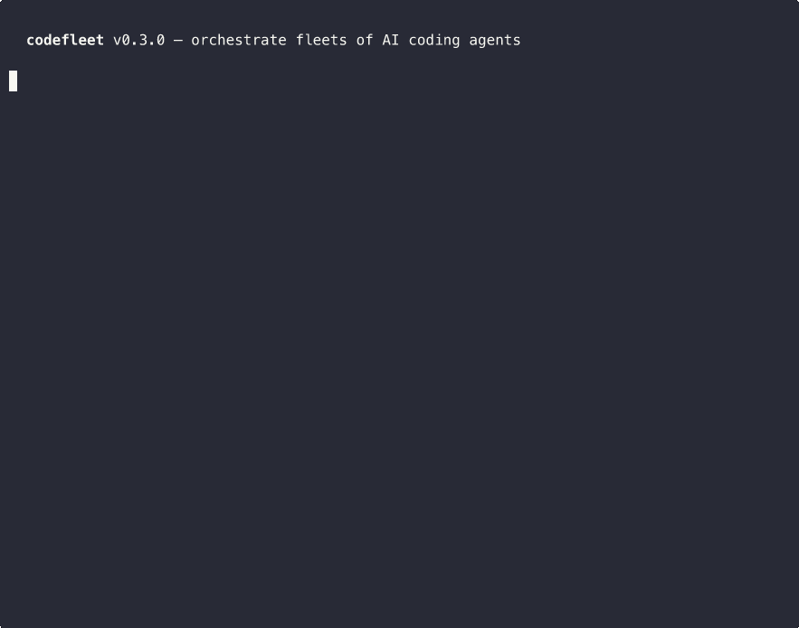

<p align="center">
  <h1 align="center">codefleet</h1>
  <p align="center">Orchestrate fleets of AI coding agents across providers</p>
</p>

<p align="center">
  <a href="https://pypi.org/project/codefleet"></a>
  <a href="https://pypi.org/project/codefleet"></a>
  <a href="https://pypi.org/project/codefleet"></a>
  <a href="LICENSE"></a>
</p>

---

An [MCP server](https://modelcontextprotocol.io/) that lets **Claude Code** dispatch work to **Codex**, **Gemini**, and **Claude** agents — running side-by-side in isolated git worktrees, with multi-stage workflows where agents collaborate across provider boundaries.

```
Claude Code  ──>  codefleet  ──>  Codex worker   (implement)
                             ──>  Claude worker   (review)
                             ──>  Codex worker    (refine from review)
```

<p align="center">
  
</p>

## Why

You have access to multiple AI coding agents. Each has different strengths. But there's no way to make them **work together** on the same codebase, passing results between stages, without manual copy-paste.

codefleet fixes this. Define a workflow, pick which agent runs each stage, and let the results flow automatically.

## Install

```bash
uv pip install codefleet
```

Or with pip:
```bash
pip install codefleet
```

### Prerequisites

At least one of these AI CLIs must be installed:

| Agent | Install | Verify |
|-------|---------|--------|
| **Codex** | `npm i -g @openai/codex` | `codex --version` |
| **Gemini** | `npm i -g @google/gemini-cli` | `gemini --version` |
| **Claude** | `npm i -g @anthropic-ai/claude-code` | `claude --version` |

Plus **Git** and **Python 3.11+**.

### Supported Models

`codefleet` constrains worker model selection to a small allowlist so orchestrators do not invent unsupported model names:

- Codex: `gpt-5.5`
- Gemini: `gemini-3.1-pro-preview`
- Claude: `claude-opus-4-6`, `claude-sonnet-4-6`

## Register with Claude Code

```bash
claude mcp add -s user codefleet -- uvx -U codefleet
```

That's it. The `-s user` scope makes codefleet available in every project automatically. Restart Claude Code and the tools are ready.

**With options:**
```bash
claude mcp add -s user codefleet \
  -e FLEET_ALLOWED_REPOS=/path/to/repo-a,/path/to/repo-b \
  -e FLEET_MAX_SPAWN_DEPTH=2 \
  -- uvx -U codefleet
```

**Project-only** (omit `-s user` to register for the current project only):
```bash
claude mcp add codefleet -- uvx -U codefleet
```

**Verify:**
```bash
claude mcp list
```

## Quick Start

Start Claude Code and ask it to use multi-agent workflows:

> "Use codefleet to add input validation to the registration endpoint. Have Codex implement it, Claude review it, then Codex refine based on the review."

Claude will call `create_workflow` with a 3-stage pipeline. Each stage runs the right agent automatically.

### Single Worker

For simple one-off tasks, use `create_worker` directly:

> "Spin up a Codex worker to add rate limiting to the API gateway"

> "Launch a Claude worker to write tests for the auth module"

> "Use a Gemini worker to refactor the database models"

## Workflows

The workflow engine runs a DAG of stages. Each stage picks an executor, gets a prompt template with variables from previous stages, and runs in an isolated (or inherited) git worktree.

### Write -> Review -> Refine

The core pattern: one agent implements, another reviews, the first refines.

```json
{
  "name": "write-review-refine",
  "task_prompt": "Add input validation to the registration endpoint",
  "stages": [
    {
      "name": "implement",
      "executor": "codex",
      "prompt_template": "{task_prompt}",
      "worktree_strategy": "new",
      "depends_on": []
    },
    {
      "name": "review",
      "executor": "claude",
      "prompt_template": "Review these changes:\n{stage_0_summary}\nFiles: {stage_0_files}",
      "worktree_strategy": "inherit",
      "depends_on": [0]
    },
    {
      "name": "refine",
      "executor": "codex",
      "prompt_template": "Address this review:\n{stage_1_summary}\n{stage_1_next_steps}",
      "worktree_strategy": "inherit",
      "depends_on": [1]
    }
  ]
}
```

### Parallel Fan-Out + Review

Multiple agents work in parallel, then a reviewer checks all of them:

```json
{
  "stages": [
    {"name": "module-a", "executor": "codex", "prompt_template": "{task_prompt}: module A", "depends_on": []},
    {"name": "module-b", "executor": "gemini", "prompt_template": "{task_prompt}: module B", "depends_on": []},
    {
      "name": "review",
      "executor": "claude",
      "prompt_template": "Review both:\nA: {stage_0_summary}\nB: {stage_1_summary}",
      "worktree_strategy": "new",
      "depends_on": [0, 1]
    }
  ]
}
```

### Competitive Implementation

Two agents implement the same thing, then a judge picks the better one:

```json
{
  "stages": [
    {"name": "codex-impl", "executor": "codex", "prompt_template": "{task_prompt}", "worktree_strategy": "new", "depends_on": []},
    {"name": "claude-impl", "executor": "claude", "prompt_template": "{task_prompt}", "worktree_strategy": "new", "depends_on": []},
    {
      "name": "evaluate",
      "executor": "claude",
      "prompt_template": "Compare:\nA: {stage_0_summary}\nB: {stage_1_summary}\nWhich is better?",
      "worktree_strategy": "new",
      "depends_on": [0, 1]
    }
  ]
}
```

See [`examples/`](examples/) for complete, copy-paste-ready workflow files.

## Template Variables

Available in stage `prompt_template` strings:

| Variable | Value |
|----------|-------|
| `{task_prompt}` | The workflow's top-level task description |
| `{stage_N_summary}` | Summary from stage N's result |
| `{stage_N_files}` | Comma-separated list of files changed in stage N |
| `{stage_N_next_steps}` | Suggested next steps from stage N |
| `{stage_N_status}` | `"completed"` or `"blocked"` |
| `{stage_N_result}` | Full result JSON from stage N |

Literal curly braces in prompts (JSON examples, code snippets) are safe — only the variables above are substituted.

## MCP Tools

### Workers

| Tool | Description |
|------|-------------|
| `healthcheck` | Verify codefleet, agent CLIs, and Git are available |
| `create_worker` | Launch a single agent in an isolated git worktree |
| `get_worker_status` | Check worker status |
| `list_workers` | List workers, optionally filtered by status |
| `collect_worker_result` | Get parsed results and optional log tails |
| `cancel_worker` | Cancel a running worker |
| `cleanup_worker` | Remove worktree, branch, and artifacts |

### Workflows

| Tool | Description |
|------|-------------|
| `create_workflow` | Start a multi-stage DAG workflow |
| `get_workflow_status` | Check workflow and per-stage status |
| `list_workflows` | List workflows with optional status filter |
| `cancel_workflow` | Cancel all running stages |
| `collect_workflow_result` | Get final or all-stage results |
| `cleanup_workflow` | Clean up all worktrees and branches |

## Configuration

| Variable | Default | Description |
|----------|---------|-------------|
| `FLEET_DEFAULT_EXECUTOR` | `codex` | Default agent: `codex`, `gemini`, or `claude` |
| `FLEET_DEFAULT_MODEL` | `gpt-5.5` | Default Codex model |
| `FLEET_GEMINI_DEFAULT_MODEL` | `gemini-3.1-pro-preview` | Default Gemini model |
| `FLEET_CLAUDE_DEFAULT_MODEL` | `claude-sonnet-4-6` | Default Claude model |
| `FLEET_DEFAULT_TIMEOUT` | `600` | Per-worker safety timeout in seconds (stale detection is the primary mechanism) |
| `FLEET_MAX_CONCURRENT` | `50` | Max simultaneous workers |
| `FLEET_MAX_SPAWN_DEPTH` | `2` | How deep agents can recursively spawn sub-agents |
| `FLEET_ALLOWED_REPOS` | *(all)* | Comma-separated allowlist of repo paths |
| `FLEET_BASE_DIR` | `~/.codex-fleet` | Data directory for workers and DB |
| `FLEET_RATE_LIMIT_MAX_RETRIES` | `3` | Auto-retries on 429 rate-limit errors |
| `FLEET_RATE_LIMIT_BASE_DELAY` | `4.0` | Initial backoff delay in seconds (doubles each retry) |
| `FLEET_RATE_LIMIT_MAX_DELAY` | `60.0` | Maximum backoff delay cap in seconds |
| `FLEET_STALE_TIMEOUT` | `120` | Seconds of no output before a worker is considered stale and restarted |
| `FLEET_STALE_MAX_RESTARTS` | `2` | Max stale restarts before giving up |
| `FLEET_HEARTBEAT_INTERVAL` | `30` | Seconds between persisted liveness heartbeats for running workers |

## How It Works

1. **Isolation** — each worker gets its own git worktree and branch (`{executor}/{task}/{id}`)
2. **Stale detection** — monitors stdout/stderr activity; restarts workers that go silent for 2 minutes (preserving worktree state)
3. **Rate-limit retry** — automatically retries on 429 errors with exponential backoff (4s, 8s, 16s)
4. **Heartbeat tracking** — running workers persist heartbeat and last-activity timestamps so stalled monitors are easier to diagnose
5. **Structured output** — every agent writes a `result.json` with summary, files changed, test results, and next steps
6. **Structured progress** — status responses include elapsed times, progress bars, and per-stage summaries
7. **Durability** — all state lives in SQLite (WAL mode), survives crashes and restarts
8. **Concurrency control** — configurable limits on concurrent workers and spawn depth

## Development

```bash
git clone https://github.com/techinfobel/codefleet
cd codefleet
uv pip install -e ".[dev]"
python -m pytest tests/ -v
python -m pytest tests/ --cov
FLEET_RUN_REAL_CODEX_SMOKE=1 python -m pytest tests/test_codex_smoke.py -m smoke -v
FLEET_RUN_REAL_GEMINI_SMOKE=1 python -m pytest tests/test_gemini_smoke.py -m smoke -v
FLEET_RUN_REAL_CLAUDE_SMOKE=1 python -m pytest tests/test_claude_smoke.py -m smoke -v
```

The real smoke tests are opt-in. They require working CLI logins and make live model calls.
You can override the Codex model/timeout with `FLEET_REAL_CODEX_SMOKE_MODEL` and `FLEET_REAL_CODEX_SMOKE_TIMEOUT`.
You can override the Gemini model/timeout with `FLEET_REAL_GEMINI_SMOKE_MODEL` and `FLEET_REAL_GEMINI_SMOKE_TIMEOUT`.
You can override the Claude model/timeout with `FLEET_REAL_CLAUDE_SMOKE_MODEL` and `FLEET_REAL_CLAUDE_SMOKE_TIMEOUT`.

## Recording the Demo

```bash
# Install asciinema + agg (for GIF conversion)
brew install asciinema
cargo install --git https://github.com/asciinema/agg

# Record
asciinema rec demo/demo.cast -c "python demo/demo.py" --cols 100 --rows 32

# Convert to GIF
agg demo/demo.cast demo/demo.gif --cols 100 --rows 32
```

## License

MIT
